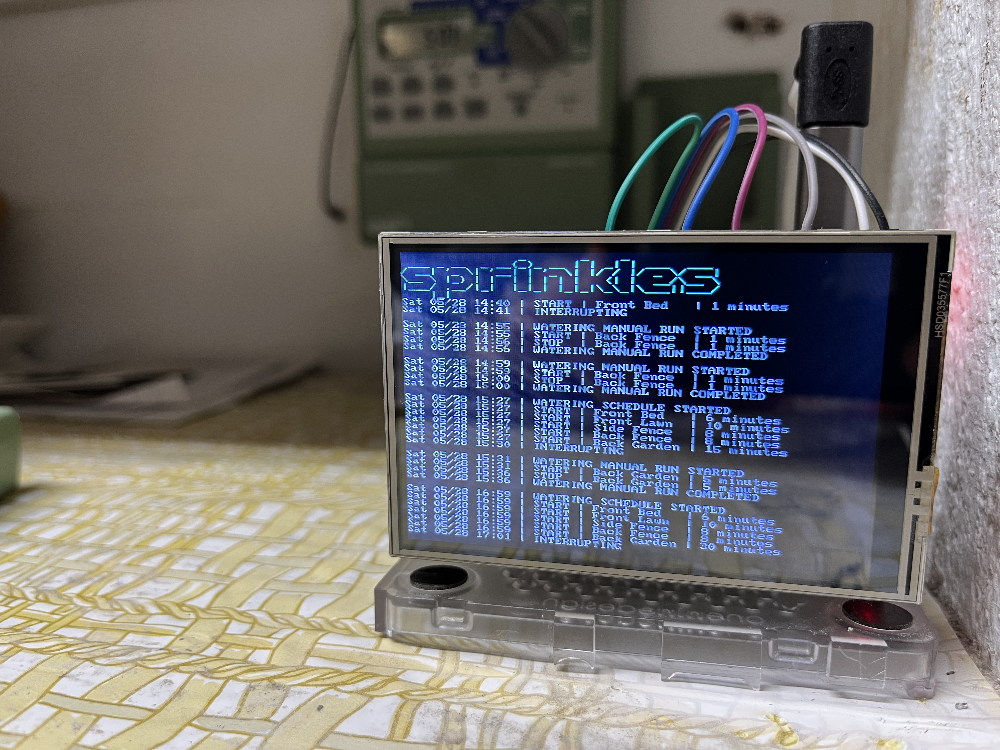

# Raspberry-Sprinkles
Use a Raspberry Pi to control your home sprinkler system.



## Hardware

*   Raspberry Pi (3 or 4)
    *   Raspberry Pi OS Lite (64 bit) - Debian Bullseye no DE
*   Power Relay Hat
    *   [8 Channel](https://www.amazon.com/gp/product/B08PSFK2L2/ref=ppx_yo_dt_b_asin_title_o03_s00?ie=UTF8&psc=1)
    *   [3 Channel](https://www.amazon.com/gp/product/B07CZL2SKN/ref=ppx_yo_dt_b_asin_title_o02_s00?ie=UTF8&psc=1)
*   3.5" Display Hat (Optional)
    *   [Waveshare 3.5inch RPi LCD (C) 320X480 Resolution Touch Screen TFT Display](https://www.amazon.com/gp/product/B07L1215W5/ref=ppx_yo_dt_b_search_asin_title?ie=UTF8&psc=1)
    *   [Waveshare Display Drivers](https://github.com/waveshare/LCD-show)
*   Assorted Jumper Wires for GPIO Pins
    *   [Breadboard Jumper Wires](https://www.amazon.com/EDGELEC-Breadboard-Optional-Assorted-Multicolored/dp/B07GD2BWPY/ref=sr_1_1_sspa?crid=3CBEKEEVH8FSE&keywords=jumper%2Bwires&qid=1653831397&s=industrial&sprefix=jumper%2Bwires%2Cindustrial%2C140&sr=1-1-spons&spLa=ZW5jcnlwdGVkUXVhbGlmaWVyPUExRU9FNjZTWjhJVzlZJmVuY3J5cHRlZElkPUEwNjQ4OTcyM1RLQ05ZRU1DNlRFSyZlbmNyeXB0ZWRBZElkPUEwOTQ1NDM2MUpBN1RMSkJGREFMWiZ3aWRnZXROYW1lPXNwX2F0ZiZhY3Rpb249Y2xpY2tSZWRpcmVjdCZkb05vdExvZ0NsaWNrPXRydWU&th=1)
*   Fuse Holder Inline
    *   [BOJACK 5x20 mm Fuse Holder Inline](https://www.amazon.com/gp/product/B0813Q4S6P/ref=ppx_yo_dt_b_search_asin_title?ie=UTF8&psc=1)
    * Check your sprinkle system to see what the max draw is, mine recommended 0.75 Amps
*   Manual On/Off Switch (Override and disable the system)
    *   [Rocker Switch](https://www.amazon.com/COOLOOdirect-Solder-Rocker-Switch-Toggle/dp/B071Y7SMVQ/ref=sr_1_3?crid=3OIHRJPLSXAT4&keywords=electronic+switch&qid=1653831746&sprefix=electronic+switch%2Caps%2C172&sr=8-3)

## Schedule Sprinkles
*   Edit dictionaries in schedule.py to update days of week to run, length of watering, and add your sprinklers/channels.
*   Add a cron job to run at the time of day you want sprinkles to run.

Run sprinklers at 5 AM
```bash
0 5 * * * /usr/bin/python /home/pi/scripts/schedule.py
```

## Manually Run Sprinkles
You can manually run sprinkles in two ways:

Example: Run sprinkles on front lawn for 5 minutes
```bash
/usr/bin/python /home/pi/scripts/manual.py -z front-lawn -t 5
```

Example: Re-run sprinkles schedule
```bash
/usr/bin/python /home/pi/scripts/schedule.py -f
```

## Stop Sprinkles
If you want to stop sprinkles while it is running, this will kill the python job and turn the GPIO pins off, turning the relays for the sprinklers off.

```bash
/usr/bin/python /home/pi/scripts/deactivate.py
```

## Sprinkles Console
To have the sprinkles console run on the display and tail the log, add the contents of ```sprinkles-console``` to your .bashrc file, install ```figlet``` and use ```raspi-config``` to auto login the pi user account.

## Mobile/Remote
If you want to control sprinkles remotely (iPhone/iPad for example) you can use something like Salt to configure Beacons/Reactors for activating the appropriate scripts. I use iOS  Shortcuts and "Run script over SSH" actions to send Beacons to my Salt master, which in turn activates Reactors on the RPI and activates sprinkles. Finally, if you have something like WireGuard you can then do this from anywhere.

## Future Functionality

*   Rain Delay
*   Weather API integration for automated schedule adjustment
*   Web Frontend Console & Control
*   More flexibility in schedule