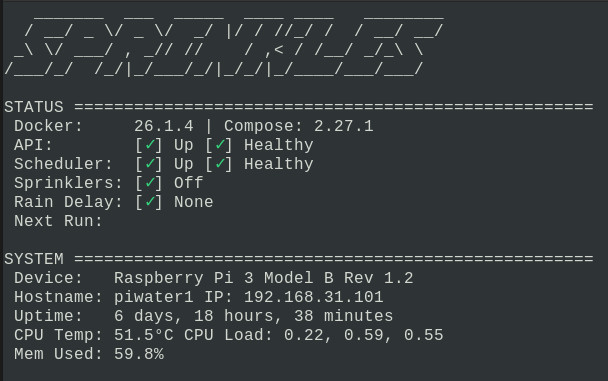

# Raspberry-Sprinkles

Use a Raspberry Pi to control your sprinkler system.



# Getting Started

## Hardware

- Raspberry Pi [3,4,5]
  - Raspberry Pi OS Lite (64 bit) - No desktop environment
- Power Relay Hat
  - [8 Channel](https://www.amazon.com/gp/product/B08PSFK2L2/ref=ppx_yo_dt_b_asin_title_o03_s00?ie=UTF8&psc=1)
  - [3 Channel](https://www.amazon.com/gp/product/B07CZL2SKN/ref=ppx_yo_dt_b_asin_title_o02_s00?ie=UTF8&psc=1)
- 3.5" Display Hat (Optional)
  - [Waveshare 3.5inch RPi LCD (C) 320X480 Resolution Touch Screen TFT Display](https://www.amazon.com/gp/product/B07L1215W5/ref=ppx_yo_dt_b_search_asin_title?ie=UTF8&psc=1)
  - [Waveshare Display Drivers](https://github.com/waveshare/LCD-show)
- Fuse Holder Inline
  - [BOJACK 5x20 mm Fuse Holder Inline](https://www.amazon.com/gp/product/B0813Q4S6P/ref=ppx_yo_dt_b_search_asin_title?ie=UTF8&psc=1)
  - Check your sprinkle system to see what the max draw is, mine recommended 0.75 Amps
- Manual On/Off Switch (Override and disable the system)
  - [Rocker Switch](https://www.amazon.com/COOLOOdirect-Solder-Rocker-Switch-Toggle/dp/B071Y7SMVQ/ref=sr_1_3?crid=3OIHRJPLSXAT4&keywords=electronic+switch&qid=1653831746&sprefix=electronic+switch%2Caps%2C172&sr=8-3)
- Wire

## Software

- https://www.raspberrypi.com/software/

## Assembly

Wiring

## Pre-Reqs

1. Clean install of Raspberry Pi OS Lite (64 bit) - No desktop environment
   - [Raspberry Pi Imager](https://www.raspberrypi.com/software/)
1. Python 3
   - `sudo apt install python3`
1. Docker & Docker Compose
   - https://docs.docker.com/engine/install/debian/
1. git
   - `sudo apt install git`
1. Clone repo
   - `git clone https://github.com/tuxthepenguin84/raspberry-sprinkles.git`

## Build

1. `docker build -f Dockerfile.api . -t sprinkles/sprinklesapi:latest --secret id=git_credentials,src=/root/.netrc --build-arg CACHEBUST=$(date +%s)`
1. `docker build -f Dockerfile.scheduler . -t sprinkles/scheduler:latest --secret id=git_credentials,src=/root/.netrc --build-arg CACHEBUST=$(date +%s)`

## Run

1. `docker compose up -d`

## bashrc (optional)

If you want the console output similar to the main picture, append the following to `.bashrc`

```
while :
do
    sudo /home/pi/git/raspberry-sprinkles/stats.sh
    sleep 10
done
```

## Files

- rsapi.py - Flask API that runs the backend of Raspberry-Sprinkles (tcp/5000)
- rsclient.py - Client library that makes it easy to interact with the API
- rsscheduler.py - Runs automated schedules
- schedule.json - (Not shown) this is a JSON file that contains your sprinklers and schedules
- rsschedule_builder.py - Builds your schedule.json based on sprinklers and specified schedules
- test_rsapi.py - Unit testing for Raspberry-Sprinkles
- run_unit_testing.sh - Used to call test_rsapi.py for unit testing
- requirements.txt - Python requirements for Raspberry-Sprinkles
- params.json - Used for issuing rain delays automatically based on weather and location information

# Running Raspberry-Sprinkles

## Build A Sprinkler Schedule

Raspberry-Sprinkles can build any type of schedule you require for your sprinkler system and supports different types of schedules depending on the current season.

1. Edit schedule_builder.py and modify "Add Sprinkler" section based on how many sprinklers you have. You will need to add a Name and Gallons Per Min, if you don't know how many gallons per min your sprinklers are fill in any number.
1. Next edit the season section and begin adding entries for each sprinkler run. Days are as follows: ['Sun', 'Mon', 'Tue', 'Wed', 'Thu', 'Fri', 'Sat']. If you want the sprinkler to run every day use "Everyday". If you want a sprinkler to run the same schedule no matter what season add it to the ALL SEASONS section.
1. When you are done run the following to build a schedule.json:<br>
   `/usr/bin/python3 /home/pi/git/raspberry-sprinkles/rsschedule_builder.py`
1. The rsapi service will automatically pickup the schedule.json and run at the requested times.

- There is a known bug where if one sprinkler is stopping in the same minute as another sprinkler is starting it will not start the sprinkler. As a result do not have any sprinklers end the same minute another sprinkler is starting.

## Run Sprinkler Schedule

Run schedule ID 1,5,9,13,17<br>
`curl -s -X PUT http://127.0.0.1:5000/runschedule -d scheduleids=1,5,9,13,17`

## Run Sprinkler

Run sprinkler 1 for 10 minutes<br>
`curl -s -X PUT http://127.0.0.1:5000/runadhoc/1 -d runtime=10`

## Stop Sprinklers

`curl -s -X DELETE http://127.0.0.1:5000/stoprunning`

## Rain Delay

Adds a rain delay for 24 hours (Increments by 24 hours on each run)<br>
`curl -s -X PATCH http://127.0.0.1:5000/raindelay`

View current rain delay<br>
`curl -s -X GET http://127.0.0.1:5000/raindelay`

Remove rain delay<br>
`curl -s -X DELETE http://127.0.0.1:5000/raindelay`

## Reset Sprinkler Schedule

`curl -s -X DELETE http://127.0.0.1:5000/resetall`

## Raspberry-Sprinkles Front End (UI)

While there is no official front end for Raspberry-Sprinkles, a basic UI can be constructed from another project call [Olivetin](https://github.com/OliveTin/OliveTin). Olivetin supports mobile browsers and makes a safe and simple web interface which can run predefined shell commands. See `olivetin/raspberry-sprinkles-config.yaml` for a sample configuration you can use and adapt into your own Olivetin instance.


## HTTPS & Proxy

There is no https support. However, I recommend building an Nginx Reverse Proxy.

## Possible Future Functionality

- ✅ | Add API Functionality
- ✅ | Support multiple schedules based on season
- ✅ | Weather integration for automated schedule adjustment - https://open-meteo.com/
- ⬜️ | Add API Key Auth: https://blog.teclado.com/api-key-authentication-with-flask/
